<div align="center">

# LifeLink

**A blood donation coordination app for hospitals, blood banks and donors.**

Built with Flutter and Firebase for **IT3060 — Human Computer Interaction**, SLIIT.

[](https://flutter.dev)
[](https://dart.dev)
[](https://firebase.google.com)
[](#running-it)

**[▶ Open the live web build](https://kavindu-maduhansa.github.io/Life-Link/)**

</div>

---

## The problem

When a hospital runs out of a blood group in an emergency, the search for a donor is still done by hand: staff phone around, write names on paper, and phone the same donor twice because nobody recorded that someone already called. Nothing tells the team how long a request has been waiting, whether another officer has already picked it up, or which of the notified donors actually replied.

LifeLink puts that whole loop in one place — a request is raised, verified by a medical officer, matched against a verified donor pool, and every contact attempt and status change is written into an audit timeline that the next shift can read.

---

## What the app covers

The app signs a user in with Firebase Auth, reads their `role` from `users/{uid}` in Firestore, and routes them into the area for that role.

| Role | Status | What it covers |
|---|---|---|
| **Hospital / Blood Bank** | Fully built | Verification queue, donor matching, response tracking, request history, stock, alerts |
| **Donor** | Fully built | Emergency requests, responding, response tracking, donation history, profile |
| **Recipient** | Entry point only | Signs in and lands on a minimal home screen |
| **Organisation / Coordinator** | Entry point only | Signs in and lands on a minimal home screen |

### Hospital / Blood Bank module

Four destinations — **Dashboard**, **Verify Requests**, **Donor Search**, **History** — plus **Alert Center** and **Blood Stock** reached from the app bar.

- **Dashboard** — pending / critical / active-response / verified-donor / unread-alert counts, an operational insight list, an emergency queue ordered by urgency then waiting time, a donor response funnel (notified → responded → accepted → completed), response-rate and average-response-time figures, blood demand by group, and a live activity feed.
- **Verify Requests** — search plus status, priority and blood-group filters, saved quick filters, and a verification flow that gates the Verify button behind a checklist (patient details complete, blood group and units valid, hospital/location confirmed). Requests that share a hospital and blood group with another active request raise a **Possible Duplicate Detected** dialog before anything is verified.
- **Request assignment** — a request can be taken over or released, and Firestore transactions decide the outcome when two officers act at once, so the second one is told rather than silently overwriting the first.
- **Donor Search / Find Matching Donors** — filter the verified donor pool by group, location and availability, see how many units are still outstanding, choose how many units a donor will provide, and notify them. Donors whose availability was never recorded are counted separately instead of being treated as available.
- **Response tracking** — every contact attempt is recorded with its outcome. The app is explicit that it *records* that an attempt was made; it does not place the call.
- **History** — full filter set, a request timeline, a **Shift Handover Report** exported as PDF for the incoming shift, and CSV export.
- **Blood Stock** — stock lines against thresholds, with a stale-data warning once the figures pass their freshness window.
- **Alert Center** — critical, new-request and donor-response alerts with an all-caught-up state.

### Donor module

Five destinations — **Home**, **Requests**, **My Responses**, **History**, **Profile**.

- **Home** — an availability banner that says plainly whether the donor is currently available to donate, a donation profile strip (blood group, location, last donation), quick actions, and an emergency call-out that links straight into the active requests in their area.
- **Requests** — active emergency requests as cards: blood group, hospital, location, units required, and an urgency label (Critical / High / Medium) carried as icon, text and colour together rather than colour alone.
- **My Responses** — every request the donor responded to, with its current state (for example *Pending Review — your response has been sent to the hospital and is awaiting review by the medical team*), the timestamp, and a short reference so the donor and the hospital are talking about the same record.
- **History** — total donations and most recent date, then one card per donation with the centre, location, clinical note, and whether the record is Completed or Verified.
- **Profile** — donor details, availability status and last donation date, with an edit action. The email is shown locked, because it is the account identity rather than an editable field.

### Across the whole app

- Onboarding gate on first launch
- Light / Dark / System appearance, persisted across restarts and applied before the first frame
- Offline banner driven by real connectivity changes, not a simulated indicator
- Live presence, so staff can see who else is on shift
- Command palette for fast navigation
- Loading, empty, no-results, error and permission-denied states throughout, each with a way forward

---

## Screenshots

> These are from the Hospital / Blood Bank module running in the web build. Sample patient, donor and request details are fictional.

| Dashboard | Response analytics |
|---|---|
| 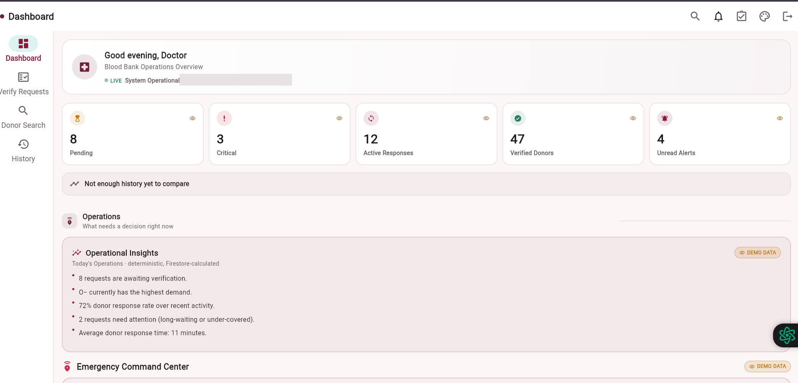 | 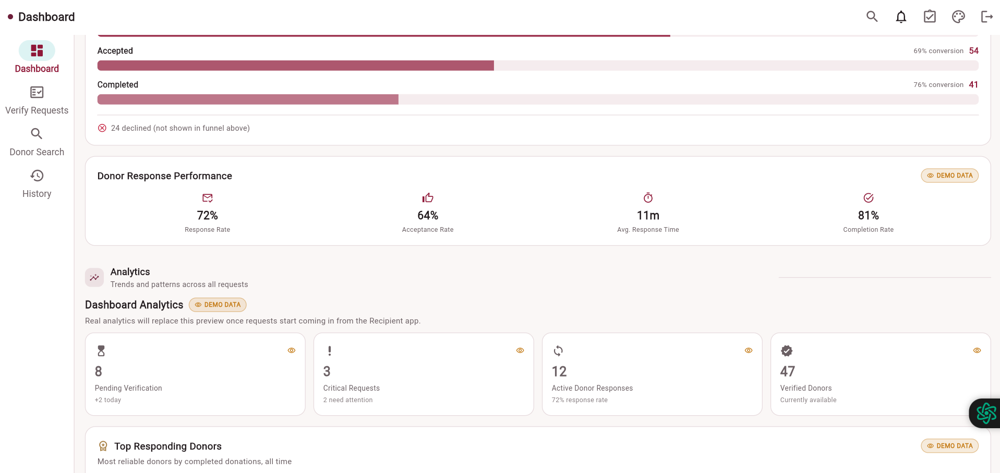 |

| Blood demand and donor pool | Verify Requests |
|---|---|
| 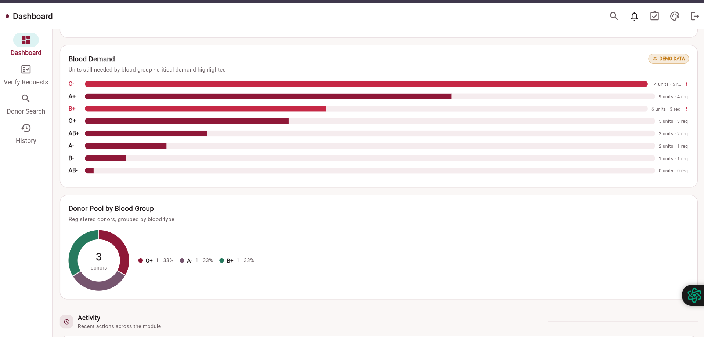 | 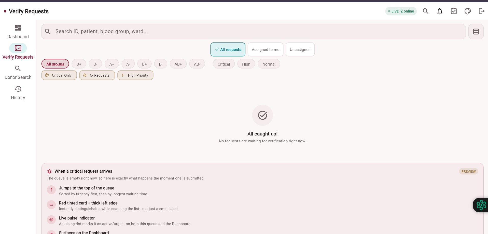 |

| Donor Search | Request History |
|---|---|
| 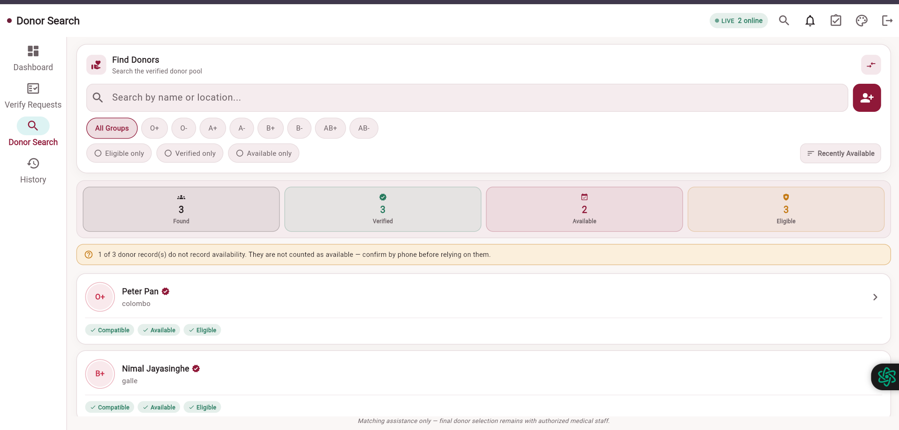 | 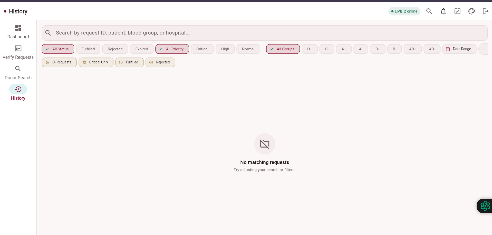 |

| Shift Handover Report | Appearance |
|---|---|
| 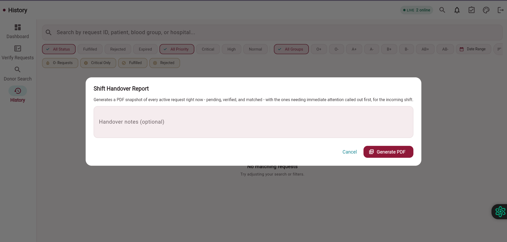 | 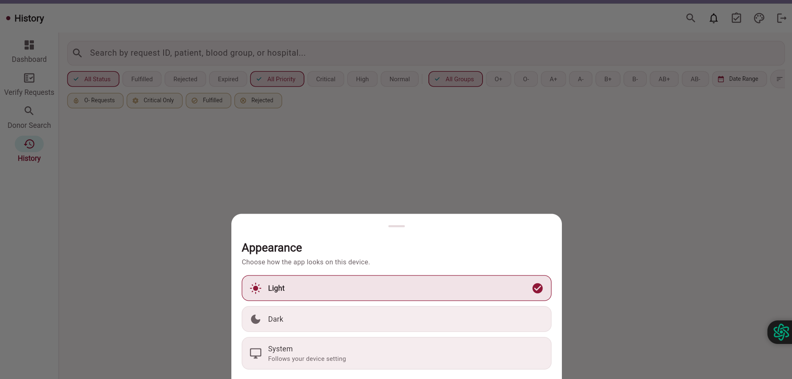 |

| Alert Center | Exported handover PDF |
|---|---|
| 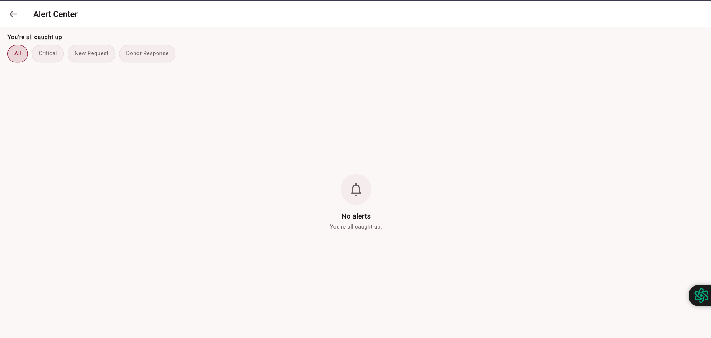 | 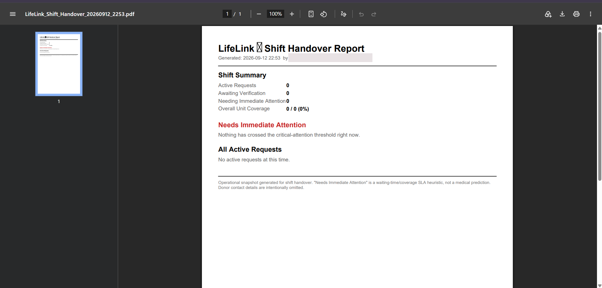 |

### Donor module

> Signed in as a donor account. The donor shown is a test account, not a real person.

| Home | Quick actions and emergency call-out |
|---|---|
| 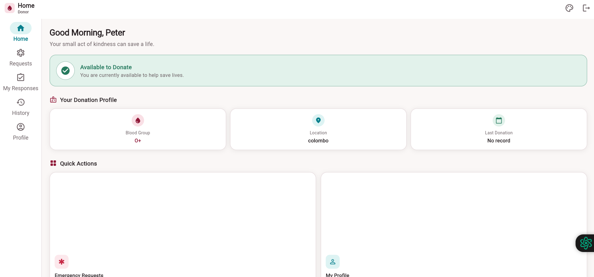 | 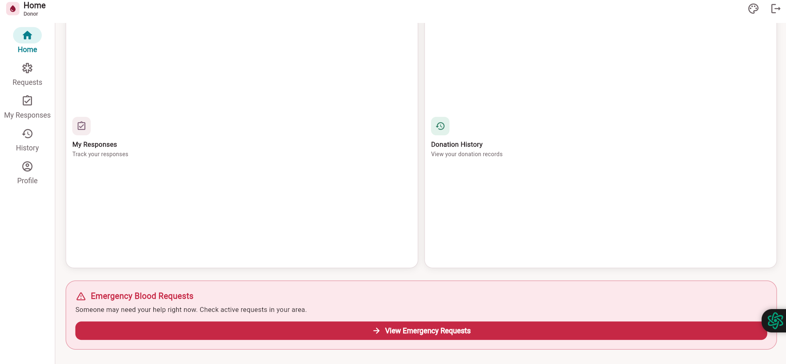 |

| Emergency Requests | Requests tab |
|---|---|
| 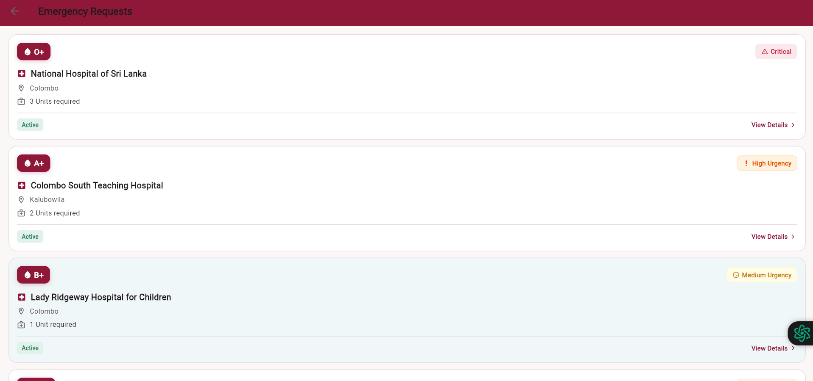 | 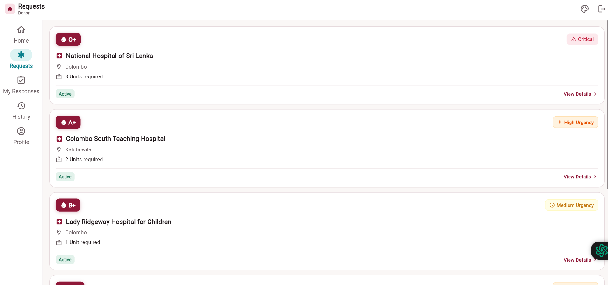 |

| My Responses | Donation History |
|---|---|
| 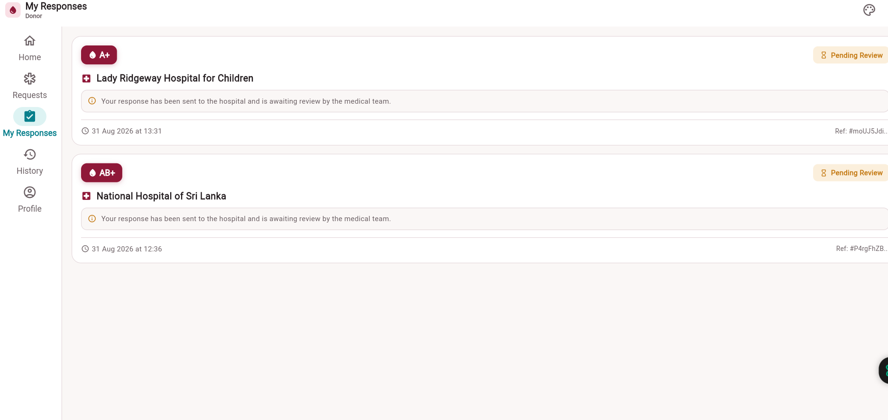 | 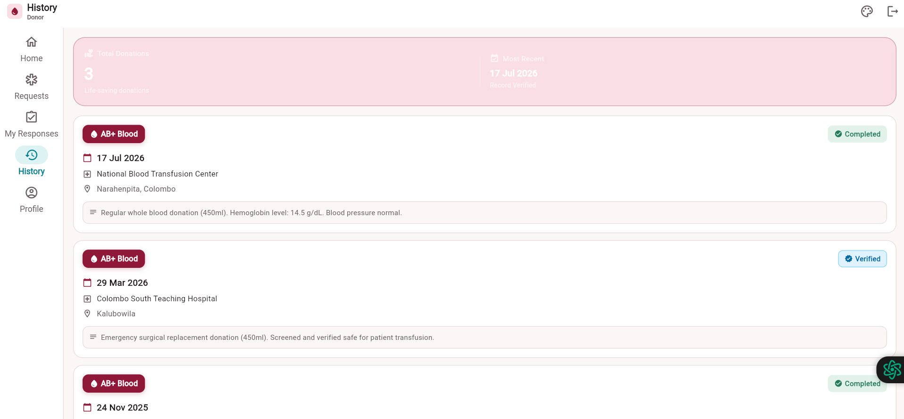 |

| Profile | Donor details |
|---|---|
| 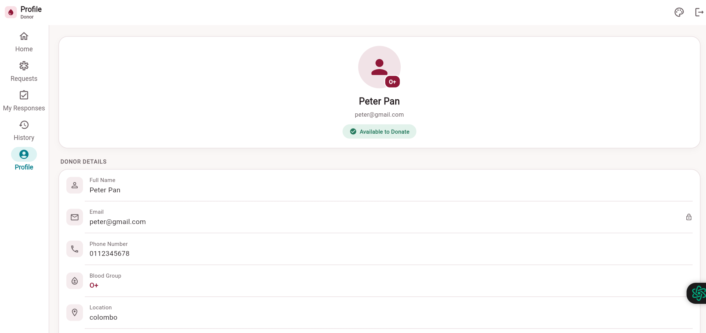 | 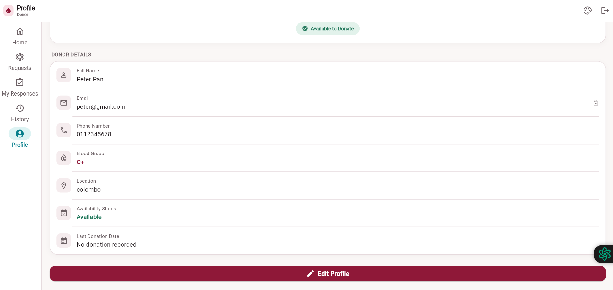 |

---

## Tech stack

| | |
|---|---|
| **Framework** | Flutter (Dart SDK `^3.12.2`) |
| **Backend** | Firebase — `firebase_core`, `firebase_auth`, `cloud_firestore` |
| **Reporting** | `pdf`, `printing`, `path_provider` (PDF reports save to disk on desktop, not just a print dialog) |
| **Preferences** | `shared_preferences` (persisted appearance) |
| **Connectivity** | `connectivity_plus` (real offline detection) |
| **Testing** | `flutter_test`, `firebase_core_platform_interface` (Firebase mocks for widget tests) |
| **Targets** | Android and Web (desktop targets are generated but not the focus) |

---

## Project structure

```
lib/
  main.dart                  Entry point: Firebase init, theme load, onboarding gate
  firebase_options.dart      Generated Firebase config
  models/                    blood_request, blood_inventory
  screens/
    onboarding/              First-launch onboarding
    auth/                    auth_gate (role routing), login, register
    hospital/                Dashboard, request details, blood stock, alerts,
                             PDF report, CSV export, and the four tabs
    donor/                   Home, emergency requests, my responses,
                             donation history, profile
    recipient/               Minimal home placeholder
    coordinator/             Minimal home placeholder
  services/                  request_service, alert_watcher, presence_service,
                             connectivity_service, theme_controller
  utils/                     Pure logic, unit tested: request status, search,
                             assignment, escalation, donor availability,
                             donor privacy, stock readiness, alert actions
  theme/                     app_colors, app_theme, lifelink_design
  widgets/                   Shared UI: timeline, health badge, offline banner,
                             command palette, skeleton loader, common states,
                             and the lifelink/ shell + component set
test/                        16 test files — unit tests for models and utils,
                             widget smoke tests for the main screens
docs/
  LIFELINK_DATA_CONTRACT.md  Firestore collections and document shapes
  LIFELINK_DESIGN_SYSTEM.md  Colour, type, spacing and component rules
firestore.rules              Firestore security rules
```

---

## Running it

**Prerequisites** — [Flutter SDK](https://docs.flutter.dev/get-started/install) 3.12 or newer, and Android Studio (or the Android SDK with an emulator) for the Android build.

```bash
git clone https://github.com/kavindu-maduhansa/Life-Link.git
cd Life-Link
flutter pub get
```

```bash
flutter run                 # run on a connected device or emulator
flutter run -d chrome       # run in the browser
```

**Build:**

```bash
flutter build apk --release
flutter build web --release --base-href /Life-Link/
```

**Tests and analysis:**

```bash
flutter analyze
flutter test
```

---

## Firebase setup

The app expects a Firebase project with **Authentication (email/password)** and **Cloud Firestore** enabled, and a `users/{uid}` document carrying a `role` field — one of `donor`, `recipient`, `hospital`, or `organisation`. Without that document and role, the app signs the user in and then tells them the role is missing rather than guessing one.

`firebase_options.dart` is generated by `flutterfire configure`.

> **Security rules.** The rules this app is designed against live in [`firestore.rules`](firestore.rules) in this repository. They must be published to the Firebase console to take effect — `firestore.rules` sitting in the repo does not change the live database on its own. The rules enforce that a user can only read their own profile, that a role cannot be escalated by editing your own document, and that staff-only collections stay staff-only.

The Firestore collections and the exact shape of each document are documented in [`docs/LIFELINK_DATA_CONTRACT.md`](docs/LIFELINK_DATA_CONTRACT.md).

---

## Design system

Colour, typography, spacing, radius and component rules are documented in [`docs/LIFELINK_DESIGN_SYSTEM.md`](docs/LIFELINK_DESIGN_SYSTEM.md) and implemented in `lib/theme/`.

Two rules run through the whole interface:

1. **Status is never colour alone.** Every state carries an icon, a text label and a colour together, so it survives greyscale printing and colour-vision differences.
2. **Nothing claims more than it does.** Preview and sample data is labelled as such, a recorded contact attempt is not described as a placed call, and donor matching is stated as assistance — the final selection stays with authorised medical staff.

---

## Status and limitations

- Recipient and Organisation roles route correctly but their home screens are minimal placeholders.
- Some dashboard panels display clearly labelled sample data until enough real requests exist to compute from.
- The web build is a demo deployment; it needs a signed-in account with a role to show anything beyond the login screen.

---

## Contributors

Built by a four-member team for IT3060 Human Computer Interaction at SLIIT. See the [contributors graph](https://github.com/kavindu-maduhansa/Life-Link/graphs/contributors) for who wrote what.

---

## License

Developed for academic purposes as part of a university course.
